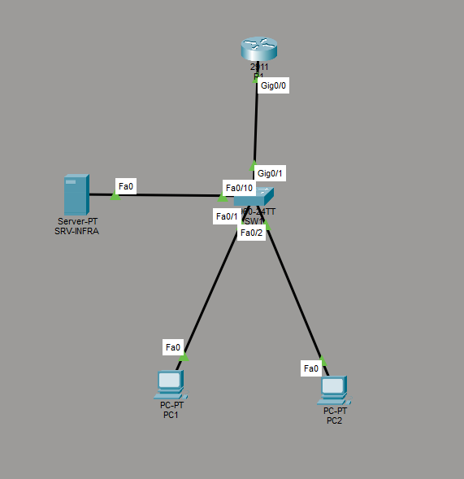
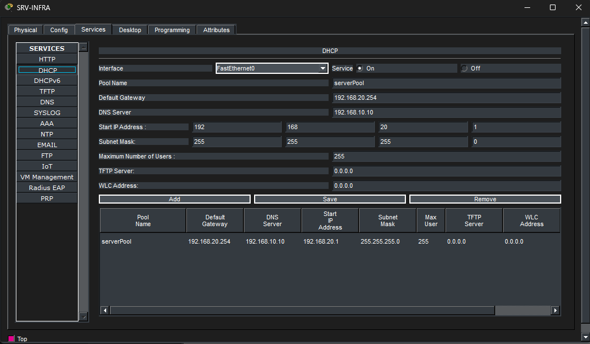
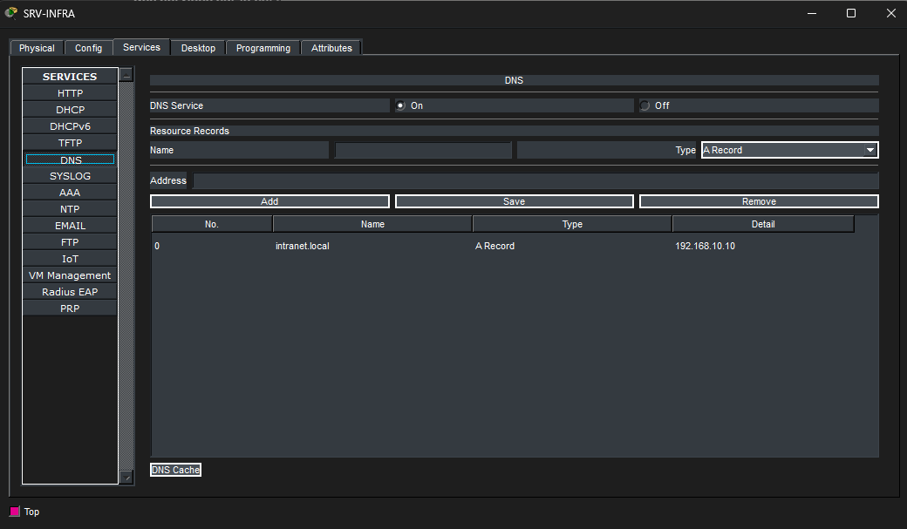
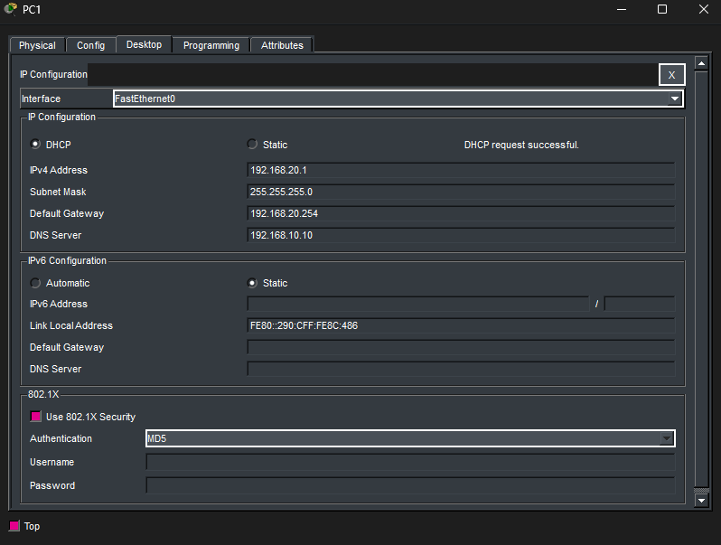
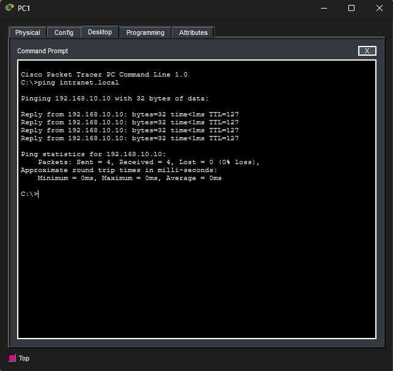

#  Déploiement de services d'infrastructure (DHCP, DNS et Relais)

Le but de ce TP était d'automatiser l'adressage IP des postes clients et la résolution de noms, comme on le ferait dans un vrai réseau d'entreprise, en centralisant les services sur un serveur dédié.

## 1. Topologie et VLANs

Pour rendre l'exercice réaliste, j'ai séparé l'infrastructure en deux réseaux virtuels distincts :
- Un VLAN 10 (192.168.10.0/24) réservé aux serveurs.
- Un VLAN 20 (192.168.20.0/24) réservé aux postes clients.

Voici la topologie de la maquette :

## 2. Configuration du Serveur Central (DHCP et DNS)

J'ai déployé un serveur unique dans le VLAN 10 (avec l'IP fixe 192.168.10.10) qui héberge deux rôles. 

Pour le rôle DHCP, j'ai configuré un pool pour distribuer des adresses IP au réseau 192.168.20.0. J'ai veillé à bien inclure l'adresse de la passerelle par défaut (.254) et l'adresse du serveur DNS pour que les clients soient pleinement connectés :

Pour le rôle DNS, le but était que les utilisateurs n'aient pas à retenir des adresses IP. J'ai donc créé un enregistrement de type A "intranet.local" qui pointe directement vers l'IP du serveur :

## 3. Le défi du routage : Le relais DHCP (IP Helper)

Le problème technique principal de ce TP était que les requêtes DHCP des clients sont des messages de diffusion (broadcast). Or, un routeur bloque par défaut ces diffusions. Les PCs du VLAN 20 ne pouvaient donc pas joindre le serveur DHCP situé dans le VLAN 10.

Pour contourner cela, j'ai implémenté la fonction de relais DHCP. Sur la sous-interface du routeur qui sert de passerelle aux clients (Gig0/0.20), j'ai ajouté la commande :
"ip helper-address 192.168.10.10"

Grâce à cette commande, le routeur intercepte les requêtes DHCP des PCs et les transfère directement au serveur en unicast.

## 4. Tests et Validation

Pour valider le fonctionnement de l'IP Helper et du serveur, j'ai passé les PCs en mode DHCP. On voit sur cette capture que le PC a bien récupéré dynamiquement une adresse dans la plage prévue, ainsi que les bonnes options réseaux :

Ensuite, pour tester le serveur DNS, j'ai effectué un ping vers le nom de domaine "intranet.local" depuis l'invite de commande d'un client. La résolution de nom s'est faite correctement et le ping a abouti :

---
Le fichier .pkt complet de cette infrastructure est disponible dans ce dossier pour consulter les configurations exactes du routeur et du serveur.
