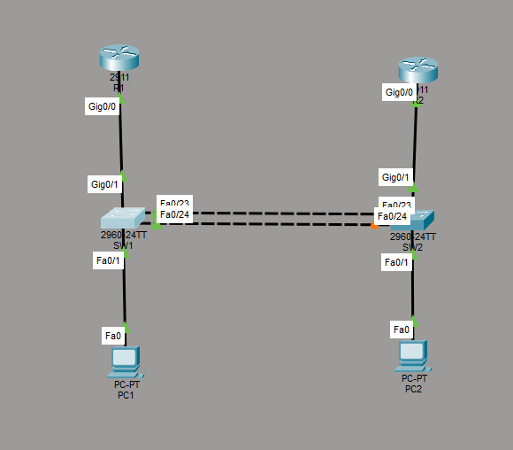
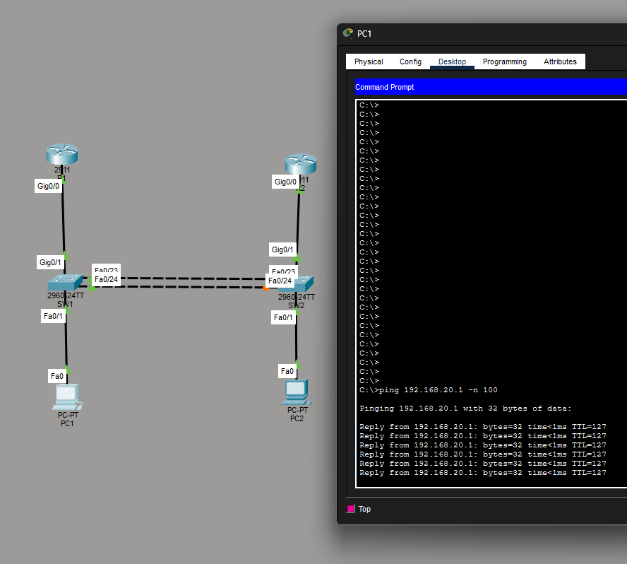
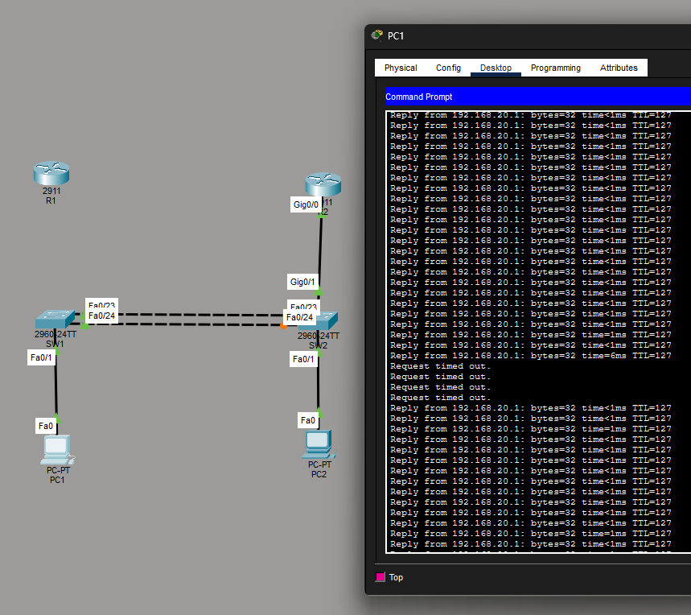

# Projet 01 : Architecture LAN & Haute Disponibilité

Ce dossier contient mon laboratoire pratique sur la création d'une infrastructure réseau locale sécurisée et tolérante aux pannes.

## Objectifs de ce TP
L'idée était de partir de zéro pour construire un réseau d'entreprise qui ne tombe pas en panne si un câble ou un routeur lâche.

* **Segmentation :** Isoler les flux avec des **VLANs** (10 pour l'Admin, 20 pour les Users) et du **Trunking 802.1Q**.
* **Résilience Niveau 2 :** Câbler les switchs en redondance et utiliser le **STP (Spanning Tree Protocol)** pour éviter les boucles, en forçant le Switch 1 comme "Root Bridge".
* **Haute Disponibilité Niveau 3 :** Configurer **HSRP** sur les routeurs pour créer une passerelle virtuelle. Si le routeur R1 tombe, le R2 prend le relais.
* **Sécurité :** Activer le **Port-Security** (`mac-address sticky`) sur les ports d'accès pour empêcher le branchement de machines non autorisées.

##  Topologie du Réseau

Voici l'architecture que j'ai montée :

## Preuve de fonctionnement (Test du HSRP)

Pour vérifier que mon réseau est vraiment redondant, j'ai fait le test de la coupure :
1. J'ai lancé un ping continu (`ping 192.168.20.1 -n 100`) depuis PC1 vers PC2.
2. J'ai "coupé" le câble entre le routeur principal (R1) et le switch (SW1).
3. Le ping a eu un "Request timed out" le temps que HSRP bascule, puis a repris instantanément via le routeur de secours (R2).

Voici la capture d'écran de l'invite de commande qui le prouve :

## 🚀 Tester mon projet
Vous pouvez télécharger mon fichier [TP_Architecture_LAN.pkt](./TP_Architecture_LAN.pkt) et l'ouvrir avec Cisco Packet Tracer pour tester les pings et regarder mes configurations (`show running-config`, `show standby brief`...).
