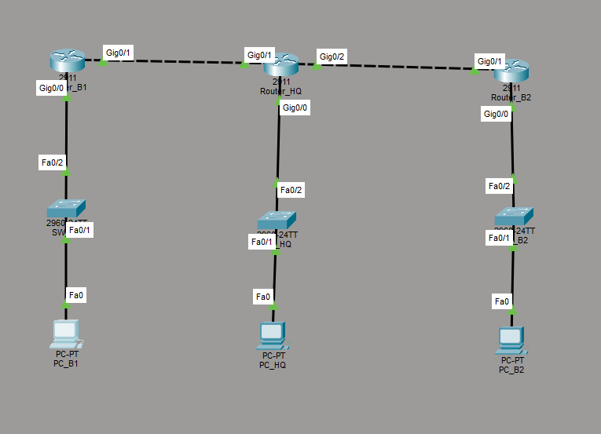
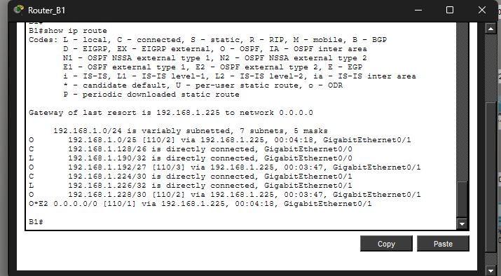
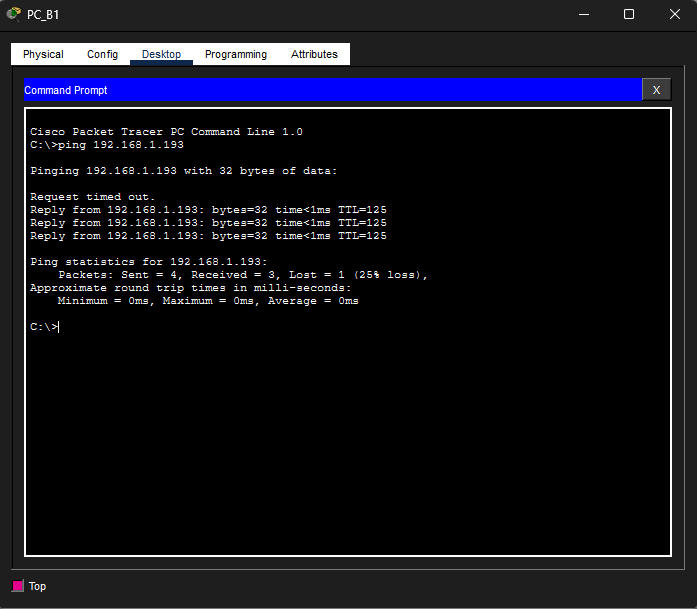

# Interconnexion WAN et Routage Dynamique (OSPF)

Ce dossier contient mon deuxième laboratoire sur Packet Tracer. L'objectif de ce TP était de relier plusieurs sites distants (un siège et deux succursales) en utilisant un protocole de routage dynamique et en optimisant le plan d'adressage IP.

## 1. Plan d'adressage (VLSM)

Pour éviter de gaspiller des adresses IPv4, j'ai utilisé la méthode VLSM (Variable Length Subnet Mask) à partir de l'adresse réseau de base 192.168.1.0/24. J'ai découpé les sous-réseaux en fonction des besoins précis de chaque site :

- Le LAN du Siège (HQ) avait besoin de 100 hôtes : j'ai utilisé le sous-réseau 192.168.1.0/25 (Masque 255.255.255.128).
- Le LAN du site B1 avait besoin de 50 hôtes : sous-réseau 192.168.1.128/26 (Masque 255.255.255.192).
- Le LAN du site B2 avait besoin de 20 hôtes : sous-réseau 192.168.1.192/27 (Masque 255.255.255.224).
- Pour les deux liaisons WAN point-à-point entre les routeurs, j'ai utilisé des masques /30 (192.168.1.224/30 et 192.168.1.228/30) pour n'avoir que deux IP utilisables par lien.

## 2. Topologie

Voici la maquette réalisée sur Cisco Packet Tracer :

## 3. Configuration du Routage (OSPF et Statique)

Au lieu de configurer toutes les routes à la main, j'ai mis en place le protocole OSPF (Area 0) sur les trois routeurs pour qu'ils découvrent le réseau dynamiquement.

Pour la partie routage statique demandée dans le TP, j'ai simulé une connexion Internet sur le routeur du Siège avec une interface Loopback (8.8.8.8) et une route par défaut (0.0.0.0 0.0.0.0). J'ai ensuite utilisé la commande "default-information originate" dans la configuration OSPF du Siège pour qu'il redistribue cette route vers les deux autres sites.

## 4. Tests et validation

Pour prouver que le réseau a bien convergé, voici la table de routage du routeur B1. On voit les réseaux distants appris via OSPF (marqués d'un "O") et la route par défaut redistribuée par le Siège ("O*E2") :

Et enfin, pour valider la connectivité de bout en bout, voici un test de ping effectué depuis le PC du site B1 vers le PC du site B2. Le trafic traverse bien les liens WAN de l'architecture :

---
Le fichier .pkt est disponible dans ce dossier si vous souhaitez ouvrir la maquette et consulter les configurations en détail.
